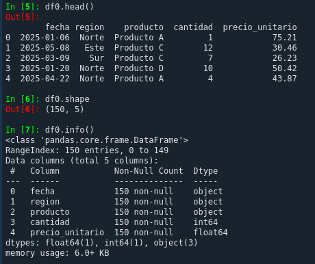
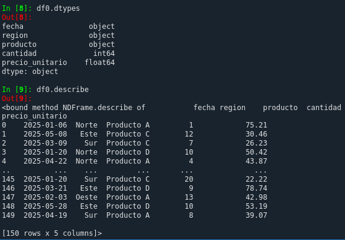

# Automatizacion Python

##### Objetivos:
1. Cargar los datos del archivo: "Archivo ventas_simuladas
2. Eliminar duplicados y registros con valores nulos
3. Calcular el total de ventas por region y mes
4. Exportar el archivvo final con el resumen en formato CSV o Excel
5. Automatiza el script para que pueda ejecutarse automaticamente cada cierto tiempo

##### Analisis exploratorio 

Despues de leer el archivo se ejecutan los siguientes métodos para analizar el dataset antes de aplicar tecnicas de pre-procesamiento

